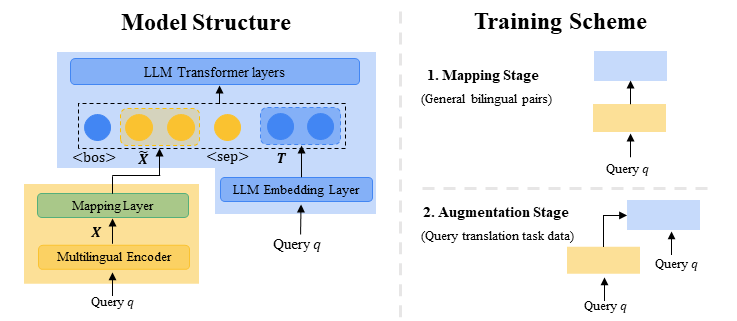

# MindMerger


MindMerger is a new method for multilingual reasoning, which merges LLMs with the external language understanding capabilities from multilingual models to boost the multilingual reasoning performance. 
A two-step training scheme is introduced to first train to embeded the external capabilities into LLMs and then train the collaborative utilization of the external capabilities and the built-in capabilities in LLMs.




## Pip Installation
```angular2html
pip install -r requirements.txt
```

## Data Preparation
Download the datasets and checkpoint in [here](https://drive.google.com/drive/folders/1HsdE63WObbMDm_3IKL6LRyGuBGdmn19c?usp=sharing) and put them under current folder.


## Evaluation
The checkpoint is the parameters of mapping layer for specfic LLM and multilingual model. To evaluate the performance of MindMerger, you can run as follow:
```angular2html
python run_evaluation.py \
    --llm_path meta-math/MetaMath-7B-V1.0 \
    --mt_path --mt_path \
    --init_checkpoint outputs/MindMerger/pytorch_model.bin \
    --augmentation True
```

## Training
We use a two-stage scheme to train MergeMinds.

**Mapping stage** helps LLM learn to use the capabilities of multilingual model.
```angular2html
deepspeed run_training.py --deepspeed \
    --llm_path meta-math/MetaMath-7B-V1.0 \
    --mt_path google/mt5-xl \
    --stage_name mapping --train_num 100000 \
    --train_batch_size 128 \
    --train_micro_batch_size_per_gpu 8 \
    --gradient_accumulation 16 --augmentation False \
    --epoch_num 3
```

**Augmentation stage** helps LLM collaboratively utilize its own and the capabilities from multilingual model.
```angular2html
deepspeed run_training.py --deepspeed \
    --llm_path meta-math/MetaMath-7B-V1.0 \
    --mt_path google/mt5-xl \
    --stage_name augmentation --train_num 30000 \
    --train_batch_size 128 \
    --train_micro_batch_size_per_gpu 2 \
    --gradient_accumulation 64 --augmentation False \
    --epoch_num 3
```
